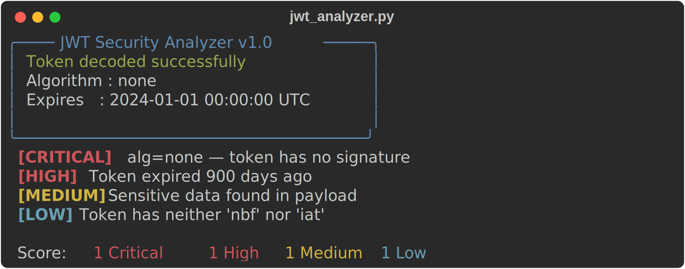

# JWT Security Analyzer

A Python CLI tool that decodes a JWT and checks it for the most common real-world vulnerabilities, producing a severity-scored report in the console, as JSON, or as an HTML file.

> **⚠️ For educational purposes only. Only use against systems you own or have explicit permission to test.** Using this against third-party services without authorisation is illegal.



## Detected vulnerabilities

| Vulnerability | Severity | What it means |
|---|---|---|
| `alg=none` | **Critical** | The token declares no signature algorithm. A server honouring it accepts arbitrary forged tokens. |
| Weak HMAC secret | **Critical** | The signing secret is recovered by brute-forcing a wordlist — anyone with it can forge tokens. |
| RS256 → HS256 confusion | **Critical** | The verifier's RSA/EC **public** key validates as an HMAC secret, letting an attacker forge tokens. |
| Expired token | **High** | `exp` is in the past; a correct verifier must reject it. |
| Missing `exp` | **High** | No expiry means the token is valid forever and never ages out. |
| Weak algorithm | **Medium** | HS256/384/512 used where asymmetric RS256/ES256 is expected in production. |
| Sensitive data in payload | **Medium** | Passwords, tokens, or PII placed in the (only base64-encoded, **not encrypted**) payload. |
| Missing `nbf`/`iat` | **Low** | No issued-at / not-before timestamps, making token lifetime harder to reason about. |

## Installation

```bash
git clone https://github.com/<your-username>/jwt-analyzer.git
cd jwt-analyzer
python -m venv venv && source venv/bin/activate   # Windows: venv\Scripts\activate
pip install -r requirements.txt
```

## Usage

```bash
# Analyze a token
python jwt_analyzer.py --token eyJhbGciOiJub25lIn0...

# Brute-force the HMAC secret using a wordlist
python jwt_analyzer.py --token <token> --wordlist wordlists/common.txt

# Detect RS256 -> HS256 confusion (supply the verifier's public key)
python jwt_analyzer.py --token <token> --public-key public.pem

# Save an HTML report
python jwt_analyzer.py --token <token> --output report.html

# Machine-readable JSON (for CI / integration)
python jwt_analyzer.py --token <token> --json
```

### Flags

| Flag | Required | Description |
|---|---|---|
| `--token` | yes | JWT token to analyze |
| `--wordlist` | no | Path to a wordlist for HMAC secret brute-force (defaults to `wordlists/common.txt`) |
| `--public-key` | no | Path to an RSA/EC public key for RS256→HS256 detection |
| `--output` | no | Path to save an HTML report |
| `--json` | no | Emit machine-readable JSON |
| `--verbose` | no | Show a detailed explanation for each finding |

The process exits with status `1` when any Critical or High issue is found, so it can gate a CI pipeline.

## Real-world CVE examples

- **[CVE-2015-9235](https://nvd.nist.gov/vuln/detail/CVE-2015-9235)** — `alg=none` acceptance in `node-jsonwebtoken`, allowing signature bypass.
- **[CVE-2022-21449](https://nvd.nist.gov/vuln/detail/CVE-2022-21449)** ("Psychic Signatures") — Java's ECDSA verification accepted an all-zero signature, so any ES256 token validated.
- **Auth0 (2015)** — RS256→HS256 algorithm-confusion attack disclosed against production deployments, where the RSA public key was usable as an HMAC secret.

## How it works

The tool decodes the token **without verifying the signature** (the point is to inspect potentially malicious tokens), then runs four families of checks:

- `checks/algorithm.py` — `alg=none` and weak-algorithm detection
- `checks/signature.py` — HMAC secret brute-force and RS256→HS256 confusion
- `checks/claims.py` — `exp` / `nbf` / `iat` temporal checks
- `checks/payload.py` — sensitive data / PII scanning

Adding a new check is a matter of writing a function that returns a list of finding dicts and wiring it into `analyze()` in `jwt_analyzer.py`.

## Testing

```bash
pytest tests/ -v --tb=short
```

The suite covers every vulnerability class with deliberately crafted vulnerable tokens. Test coverage is **85%+**.

## License

[MIT](LICENSE)
